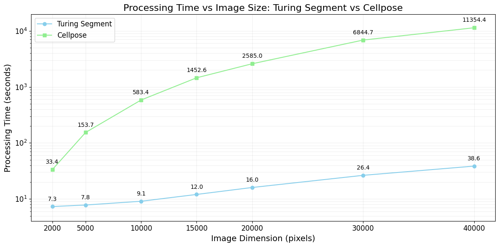
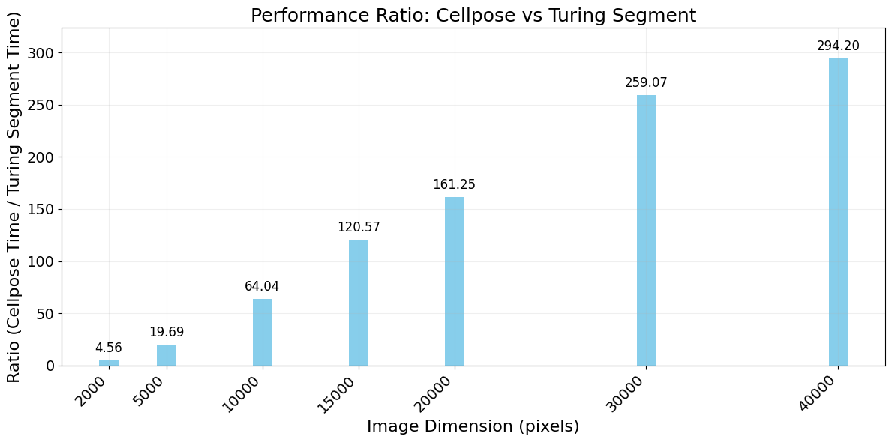
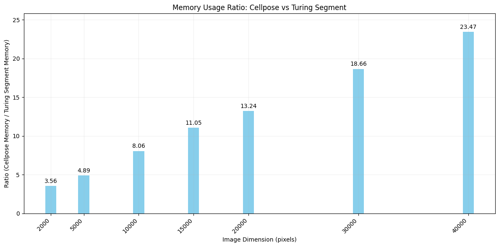
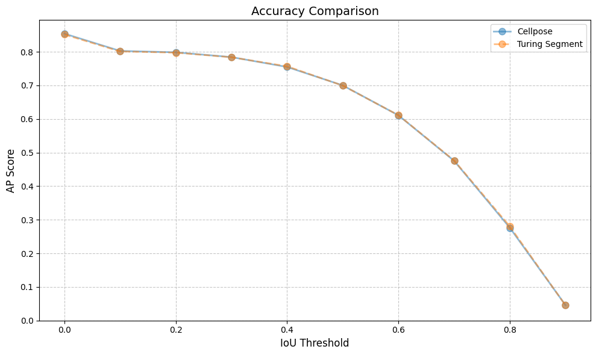

# Turing Segment: High-performance Cellpose Algorithm

***Turing Segment*** is a high-performance package for cell segmentation based on the popular [Cellpose](https://github.com/MouseLand/cellpose) algorithm. It is designed to provide lightning-fast performance while maintaining the accuracy and robustness of the original Cellpose model.

Explore our [blog post](https://bioturing.com/blog/turing-segment-a-high-performance-cellpose-algorithm-for-cell-segmentation/) for in-depth details.

## Features
- Built on top of the Cellpose framework, leveraging its proven segmentation capabilities.
- Our new post-processing algorithm is significantly faster than the original Cellpose algorithm, reducing computational overhead and enabling faster processing times.
- Support Tiled processing that is optimized for handling large images. This allows for segmentation of high-resolution or whole-slide images without running into memory constraints.
- Turing Segment is highly parallelized, leveraging both CPU and GPU resources to achieve accelerated processing speeds.
- The package is designed to be easy to use. It provides a simple CLI for quick integration into your image analysis workflows.

## Requirements
- NVIDIA GPU (recommend 40xx series, but it should work on lower series as well)
- CUDA Runtime 11.7 or later
- Python 3.8 or later
- PyTorch 2.0 or later
- geopandas 1.0 or later

## Installation

We recommend using conda to install Turing Segment. Run the following command to create a new conda environment:

```bash
conda create -n turing_segment python=3.10
conda activate turing_segment
```

Make sure your PyTorch version is compatible with the CUDA Runtime version and select the correct PyTorch version from the [PyTorch website](https://pytorch.org/get-started/locally/). For example, if you have CUDA 12.1, use the following command to install PyTorch:

```bash
conda install pytorch pytorch-cuda=12.1 -c pytorch -c nvidia
```

Install Turing Segment using `pip`:

```bash
pip install -U turing_segment
```

## Usage

We provide three types of commands: 
- `infer`: segment the image
- `poly2mask`: convert polygons to zarr labeled mask
- `stitch`: Stitch 2D cell segmentation results into 3D cells

To see the full list of available options, use the `--help` flag.

```bash
turing_segment --help
```
---
### Inference

**1. Single image segmentation**
```bash
tuirng_segment infer --image-path /path/to/image --output-dir /path/to/output_dir
```    
By default, the model used is `cyto3`, if you want to use HE model, you must provide the `--model-type he2` argument or `--model-type he` for old HE version.

```bash
tuirng_segment infer --image-path /path/to/image --model-type he2 --output-dir /path/to/output_dir
```   

Output format:

```
/path/to/output_dir/
├── metadata.json
└── polygons.parquet
```

- `metadata.json` contains the information of the image, including the `image-shape`, `scale`, `model-type`, ... of the image. 
- `polygons.parquet` contains the polygons of the segmented cells in Shapely geometry format.

If the `--output-dir` is not provided, the output dir will be created with the name `{image_name}_{page}_{channels}_{model_type}`.

---
**2. Segmentation for multiple images**

To segment multiple images, replace the `--image-path` with `--image-dir` to specify the folder containing multiple images.

```bash
tuirng_segment infer --image-dir /path/to/image_dir --output-dir /path/to/output_dir
```
If the `--output-dir` is not provided, the output dir will be created with the name `{image_dir}_results`.

Output format:
```
/path/to/output_dir/
├── configs.yml
├── image_name1/
│   ├── metadata.json
│   └── polygons.parquet
├── image_name2/
│   ├── metadata.json
│   └── polygons.parquet
└── ...
```

`configs.yml` will be automatically generated to store the postprocess config for each image. We only support for storing the config for 3D stitching. If you want to run 3D stitching, you must modify `z_index` for each image name in the config file.

Example of `configs.yml`:
```yaml
stitch:
- image_name: image_name1
  z_index: null
- image_name: image_name2
  z_index: null
```

---
**3. Specify the `channels`**

<!-- To specify channels to segment, use the `--channels` flag. The channels are specified as a comma-separated list of channel indices where the first channel is for membrane and the second channel is for nucleus. If the nucleus channel is not specified, a zero channel is used. -->
To specify channels to segment, use the `--channels` flag. The channels are specified as a comma-separated list of channel indices. You must past the channel indices in the order of the model input. 
    
  - Fluorescence image: The first channel is for membrane and the second channel is for nucleus. If the nucleus channel is not specified, a zero channel is used.
    ```bash
    tuirng_segment infer --image-path /path/to/image --model-type cyto3 --channels 0,1
    ```
    
  - Hematoxylin and eosin (H&E) image: The first channel is for red, the second channel is for green, and the third channel is for blue (RGB).
    ```bash
    tuirng_segment infer --image-path /path/to/image --model-type he2 --channels 0,1,2
    ```
If the image has the channel in the last dimension, use the `--channel-last` flag.  

---
**4. Specify the `image-type`**

You can specify the image type explicitly using the `--image-type` flag. If the flag is not specified, the image type is inferred from the input file. Currently, `tiff`, `zarr` and `cv2` are supported image types.

```bash
turing_segment infer --image-path /path/to/image --image-type tiff
```

---
**5. Specify the `config-file`**

The tool also supports modifying some parameters of the segmentation process and post-processing. This can be done by using `--config-file` to specify a YAML configuration file containing the parameters:

```bash
turing_segment infer --image-path /path/to/image --config-file /path/to/config.yaml
```

A sample config file can be found from `configs/config.yaml`, the parameters from the file are also the default parameters for the segmentation process and post-processing:

```yaml
pipeline:
  infer_size: 1024              # Tile size (in pixels) to feed the model. The size is of the scaled tiles, not the original tiles from dividing the input image.
  overlap_margin: 32            # Margin (in pixels) to overlap between tiles during inference to reduce edge artifacts. Also of the scaled tiles.
  n_postprocess_processes: 32   # Number of parallel processes used for post-processing
  postprocess_queue_size: 128   # Size of the queue to store model output before post-processing
  n_merge_tile_processes: 16    # Number of parallel processes used to merge tiles into the final output

postprocess:
  niter: 200                    # Number of iterations for following the flow
  cellprob_threshold: 0         # Threshold for the probability of a pixel being part of a cell (in logit; 0 corresponds to 0.5 probability)
  flow_threshold: 0.4           # Threshold for the flow magnitude to filter out low-confidence regions
  min_size: 15                  # Minimum size (in pixels) for objects to be considered as cells
  resample: false               # Whether to resample the output to match the original image size when postprocessing (false to keep the inferred size). When scale > 1, set to true will improve postprocessing performance
```

---
**6. Checkpoint download** 

By default, the model checkpoints are downloaded if they are not present in the cache directory. If you want to use a custom checkpoint from cellpose training pipeline, you can specify the paths to the model and size model checkpoints using the `--model-path` and `--size-model-path` flags, respectively. You may skip specifying `--size-model-path` if a provided scale is specified by ``--scale``.

```bash
turing_segment infer \ 
--image-path /path/to/image \
--model-type <cyto_or_he> \
--model-path /path/to/model_checkpoint \
--size-model-path /path/to/size_model_checkpoint
```

---
### Poly2mask

We provide a command to convert the polygons to zarr labeled mask. The default behavior should be getting shape from `metadata.json` in the same folder with the polygons file. If the `metadata.json` is not found, we will default the mask shape as max of the polygons coordinates. If your polygons not generated from our segmentation, please make sure the input `polygon_dir` contains the `polygons.parquet`

```bash
turing_segment poly2mask /path/to/polygons --output-dir /path/to/output_dir
```

If the `--output-dir` is not provided, the output will be created in the same folder with the polygons file with the name `mask.zarr`.

---
### 3D Stitch

We provide a command to stitch 2D segmentation results to 3D segmentation results. With each polygon in the $i'th$ image will be matched with the polygon in the $(i+1)'th$ image with the highest IOU (intersection over union). If the highest iou is less than the threshold, the polygon will be considered as a new object. If `--iou-threshold` is not provided, we will default the iou threshold as 0.5.

```bash
turing_segment stitch /path/to/segmentation_results --output-dir /path/to/output_dir --iou-threshold 0.5 --num-process 8
```
The `/path/to/segmentation_results` is the folder contains all the folder of the segmentations. Each folder must contain the `polygons.parquet` and `metadata.json` files. The `metadata.json` file must contain the `z_index` field to indicate the z-index of the image.
 
If `--output-dir` is not provided, the output will be saved in the same folder of the segmentation results with the name `3d_polygons.parquet`.

Default the stitching algorithm will run in 8 processes. For disable multi-process (only run in main process), set `--num-process` to 0.

**For example of each command, please refer to the [EXAMPLE.md](./example/EXAMPLE.md) file.**

## Benchmark

1. Processing Time:
   - Turing Segment significantly outperforms the original Cellpose, especially for larger images.
   - For a 40,000 x 40,000 pixel image, Turing Segment is 294 times faster, reducing processing time from hours to less than 1 minute.

   
   

2. Memory Consumption:
   - Turing Segment uses considerably less memory than the original Cellpose.
   - For a 40,000 x 40,000 pixel image, Turing Segment consumes 23 times less memory.

   
   

3. Accuracy:
   - Turing Segment maintains comparable accuracy to the original Cellpose algorithm.

   

These improvements allow Turing Segment to process larger images more efficiently while maintaining accuracy.

## Feedback

If you encounter any issues or bugs while using Turing Segment, please let us know by submitting an issue on this GitHub repository.

For other feedback or support, you can reach out to our dedicated support team at [support@bioturing.com](mailto:support@bioturing.com).


