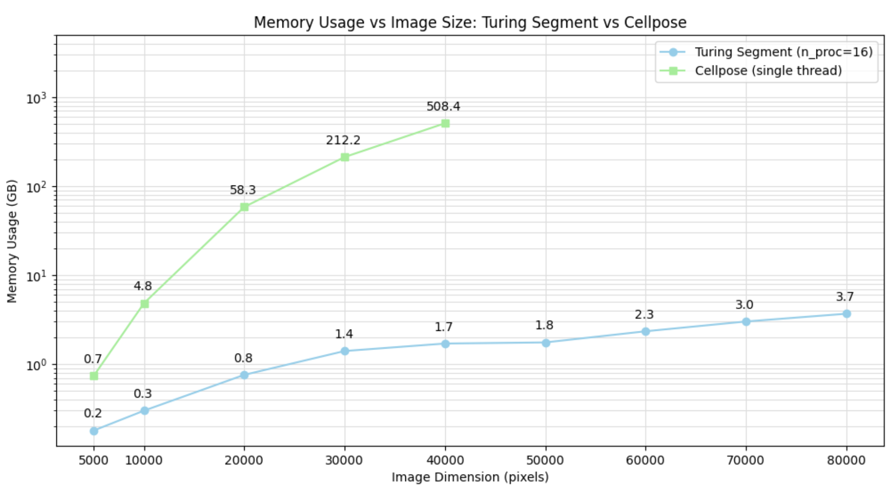

# Turing Segment: Technical Report

## What is Cellpose Algorithm?
Cellpose is a popular deep learning algorithm for cell segmentation across a wide range of different tissue types, cultures, and imaging techniques. However, Cellpose faces some computational challenges:
- **Long processing time**: Cellpose consumes a significant amount of time to process large images, producing from spatial data experiments or pathology slides.
- **High memory requirements**: Cellpose requires a large amount of memory, and the required memory scales up with the image size.

## **Turing Segment**: An Optimized Cellpose Algorithm

To address these issues, we have developed an optimized version of Cellpose that aims to improve its running time and memory performance while maintaining Cellpose’s accuracy. 

### Dynamic Programming Algorithm for Post-processing

The Cellpose algorithm consists of two phases: AI model inference and post-processing. Post-processing is the primary bottleneck of the algorithm, typically requiring up to  200 times longer than the model inference phase.

During the post-processing phase, the most time-consuming task is the dynamic process of grouping pixels into individual cell instances and it represents a significant opportunity for performance optimization.

The dynamic process has a key property: the subsequent positions of a pixel depend solely on its current position. This characteristic allows us to reformulate the problem into a series of optimal subproblems, which can be efficiently addressed using Dynamic Programming techniques.

### Tiled Processing

When working with high-resolution or whole-slide images, processing the entire image at once can often lead to memory constraints. To address this challenge, Turing Segment employs a tiled processing approach. This method divides the image into equally sized tiles, allowing each tile to be processed independently to obtain segmentations while significantly reducing memory consumption.

One issue that arises with tiled processing is that segmentations at the boundaries of tiles may be incomplete. To mitigate this, Turing Segment introduces a margin around each tile, ensuring that overlapping areas are included in the segmentation process. After processing all tiles, duplicate segmentations are removed.

### Parallelization

**Turing Segment** is designed with extensive parallelization in mind, leveraging both CPU and GPU resources to achieve accelerated processing speeds.

Model inference and post-processing operations run in parallel, ensuring that both GPU and CPU resources are utilized effectively without idling. This simultaneous processing keeps the workflow efficient. Post-processing is further enhanced through parallelization. A pool of workers is utilized to process inference results for tiles as they become available.

The deduplication algorithm also benefits from parallel processing, as segmentation pairs to check are evenly distributed across multiple processes. This approach significantly speeds up the duplicate removal process.

## Benchmark

### Inference

All benchmarks are generated with the following specifications:
- GPU: NVIDIA RTX 4090
- CPU: AMD Ryzen Threadripper PRO 7985WX 64-Cores
- Libraries: PyTorch 2.4, CUDA Runtime 11.8, cuDNN 9.1.0.70

To test the effectiveness of the mentioned improvements, we compare the Turing Segment tool to the original Cellpose algorithm. The table below summarizes supported features of the tools

| Feature           |     Turing Segment     | Original Cellpose |
|:------------------:|:----------------------:|:-----------------:|
| GPU Acceleration  |           ✅            |         ✅         |
| Tiled Processing  |           ✅            |         partial         |
| Post-processing   | Bioturing's DP Algorithm| Original Algorithm|
| Parallelization   |           ✅            |         ❌         |

This benchmark compares the processing time and memory between Turing Segment and the original Cellpose using 16 processes. The plots below show the processing time for the original Cellpose and Turing Segment. All images are squared (dxd) with dimension d is represented in the horizontal axis). 

Turing Segment outperforms the original Cellpose with different image sizes. The difference is more significant as the image size increases. For the image with size 40,000 x 40,000 Turing Segment is 294 times faster than the original Cellpose, reducing the processing time from a few hours to less than 1 minute.

The plots below shows the memory consumption between the two tools:

Thanks to our tiled processing, Turing Segment’s memory consumption is reduced rapidly. For the image with size 40000x40000, our tool consumes 23 times less memory than the original Cellpose. This improvement reduces the hardware requirements and allows us to process even larger images (discussed in the next session).

While achieving impressive speedup, Turing Segment does not sacrifice accuracy. The plot below shows the accuracy of the Turing Segment  and the original Cellpose.

### Stitching segmentations into 3D cells

Our algorithm for stitching segmentations into 3D cells leverages the STRTree data structure to minimize the number of segmentation pairs to compute IOUs (the main computational cost of the stitching process). It's further accelerated by paralleling the IOUs computation in multiple processes.

In this benchmark, we compare the performance and memory consumption between algorithms from Turing Segment and the original Cellpose to stitch segmentations. The plots below show the processing time and memory consumption of Turing Segment (16 processes) and the original Cellpose algorithms. Due to the memory constraints, the original Cellpose can only process images up to 40000x40000 in size.

Our algorithm consumes much less memory than the original Cellpose. For the image with size 40000x40000, Turing Segment consumes nearly 300x less memory than the original Cellpose. The algorithm is also 400x faster than the original Cellpose. 

To understand the efficiency of our parallelization, we plot the processing time as the number of processes increases. The processing time scales well with the number of processes, demonstrating near-linear speedup up to 16 processes.

